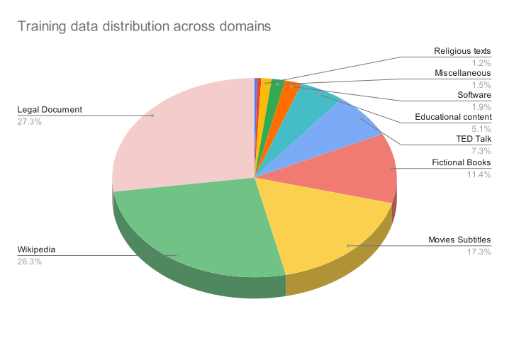
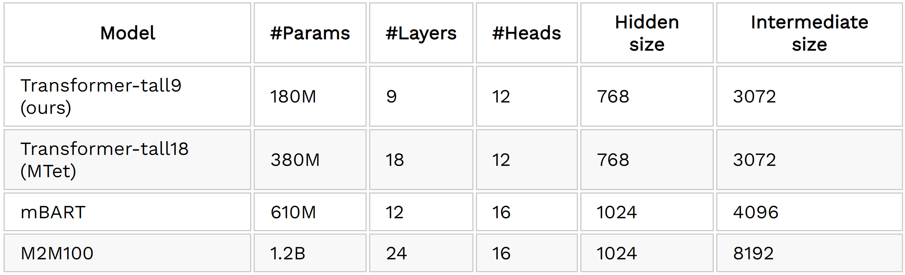
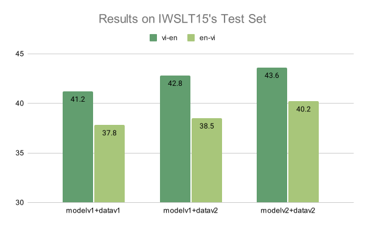
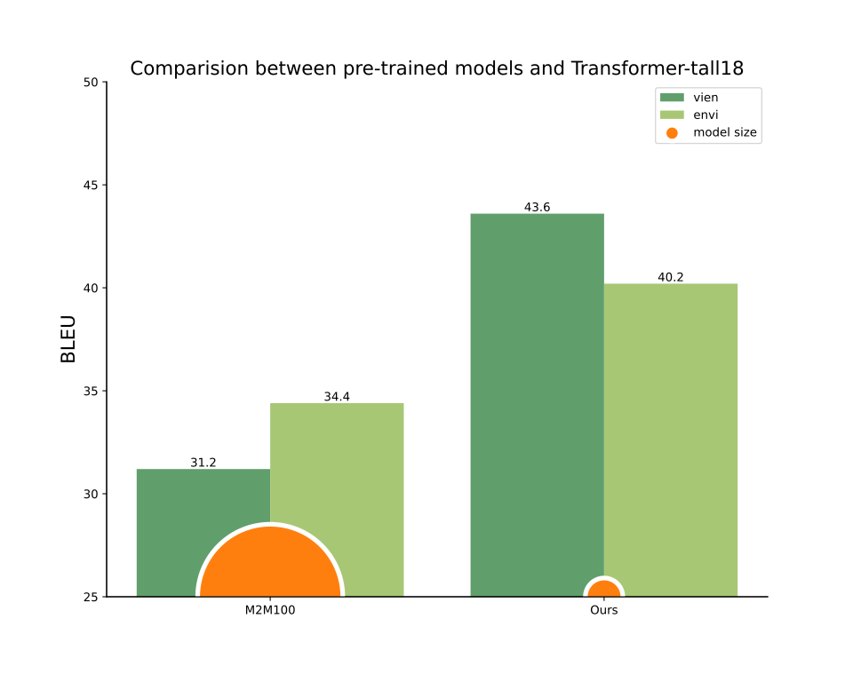

[](https://paperswithcode.com/sota/machine-translation-on-iwslt2015-english-1?p=mtet-multi-domain-translation-for-english)

## Introduction
Machine translation (MT), the task of mapping content from one language to another automatically by computers, is unarguably one of the most important applications of natural language processing (NLP). 
Despite great progress in MT using AI, specifically deep learning and neural networks, English-Vietnamese translation quality still lags behind, mostly due to the lack of high-quality datasets at scale. 
Recently, VietAI[^1] has [released](https://blog.vietai.org/sat/) a high-quality English-Vietnamese translation corpus of 3.3M examples to the research community[^2] to spur further progress in research.

Continuing this effort, we are excited to introduce our second release of VietAI’s MTet project, which stands for **M**ulti-domain **T**ranslation for **E**nglish and Vie**T**namese. 
With this release, we further improved on the first-ever multi-domain English-Vietnamese translation dataset at scale to release up to 4.2M examples across 11 domains. 
In addition, we demonstrated state-of-the-art results on [IWSLT’15](https://paperswithcode.com/sota/machine-translation-on-iwslt2015-english-1) (+3.5 BLEU for English-Vietnamese). We hope that our efforts will inspire further contributions to an ever-growing repository of high-quality datasets for the Vietnamese NLP community.

[^1]: VietAI is a non-profit organization with the mission of building a community of world-class AI experts in Vietnam. VietAI has nurtured and trained thousands of students and experts in AI, 3 of whom are the first Google Developer Experts in Machine Learning in Vietnam.
[^2]: There are also concurrent efforts from [VinAI](https://github.com/VinAIResearch/PhoMT) and [VLSP](https://vlsp.org.vn/vlsp2021/eval/mt).

## Dataset
<!--- TABLE 1 -->

<Tabs size={6}>
<Tab label="Medical">

English|Vietnamese
---|---
We report a seven-year-old female presenting with fever, dry cough, and abdominal pain after that.|Chúng tôi báo cáo một trường hợp bệnh nhi nữ, 7 tuổi vào viện với triệu chứng ho khan, sốt và đau bụng dữ dội sau đó.

</Tab>


<Tab label="Law">

English|Vietnamese
:--|:--
This Law was passed on June 9, 2000 by the Xth National Assembly of the Socialist Republic of Vietnam at its 7th session.|Luật này đã được Quốc hội nước Cộng hòa xã hội chủ nghĩa Việt Nam khóa X, kỳ họp thứ 7 thông qua ngày 09 tháng 6 năm 2000.

</Tab>

<Tab label="Religion">

English|Vietnamese
:--|:--
The problem comes when grasping and attachment dominate your mind and you put all your faith in other people and material possessions.|Những trở ngại thực sự đến với chúng ta khi lòng tham và sự bám víu bắt đầu ngự trị trong tâm chúng ta và khi chúng ta đặt hết tin tưởng vào người khác và vào sự sở hữu vật chất.

</Tab>

<Tab label="Software">

English|Vietnamese
:--|:--
Without arguments, 'print' displays the entire partition table. However with the following arguments it performs various other actions.|Khi không có đối số, " print " hiển thị toàn bộ bảng phân vùng. Nếu đưa ra các đối số theo sau, thì nó làm một số hành vi khác.

</Tab>

<Tab label="Movie">

English|Vietnamese
:--|:--
Then we could buy a castle and live in it with armed guards patrolling outside to keep out Count Olaf and his troupe.|Lúc đó chúng ta có thể mua một lâu đài và sống ở đó với bảo vệ ôm vũ khí đi tuần bên ngoài để ngăn chặn Bá tước Olaf và băng đảng của ông ta.

</Tab>

<Tab label="Wiki">

English|Vietnamese
:--|:--
Many great artists such as Michelangelo, da Vinci and Sir Edwin Henry Landseer were ambidextrous.|Nhiều nghệ sĩ vĩ đại như Michelangelo, da Vinci và Edwin Henry Landseer cũng là người thuận hai tay.

</Tab>
</Tabs>

<br />
<i><center>Table 1. Some examples in different domains from the training set.</center></i>
<br />

In this release, we cleaned and deduplicated our first version of the dataset (datav1), while adding in 1.2M training text pairs from various text sources. 
This grows our dataset from 3.0M to near 4.2M training text pairs in datav2.

The additional data comes from two sources. First, we use modelv1 to score, filter, and pair high-quality data from existing large and noisy sources (OpenSubtitles, MultiCCAligned, and Wikilingua) that has yet to be incorporated in datav1. 
Second, we perform a mix of automated and manual scraping from a list of 30 public websites, ranging across multiple different domains such as medical publications, religious texts, engineering articles, literature, news, and poems. 
We also calibrated our previous test set to balance between different translation domains.




## Utilizing Google Cloud Platform, TPUs, and Tensorflow
By using TPU v3-8 and TPU v3-32, we were able to train larger Transformer models and achieved state-of-the-art results on multiple test sets. Utilizing Google Cloud Storage with flexibility in region, we are also able to distribute our data pipelines for training on each specific Transformer model and TPUs (v2-8, v3-8, and v3-32). 
The improvement in the training speed of TPU v3 (compared to TPU v2-8) also allows us to train large models for longer and faster.

Thanks to GCP credit generously provided by Google Cloud, we are able to run 10 TPUv2 in parallel to score and filter high-quality training data from very large but noisy translation datasets such as MultiCC (20M sentences) and OpenSubtitles corpus (3.5M sentences), in the end, contributed close to half of the new data.

In our experiments, we made use of the [tensor2tensor](https://github.com/tensorflow/tensor2tensor) library, written in Tensorflow, which supports training high-performing translation models on TPUs.


## Model and Results
In addition to improving dataset size and diversity, we employed vanilla Transformer architecture with Transformer-tall18 setting, doubled in size when compared to Transformer-tall9 (See Table 1 for more details) and better in translation quality in IWSLT2015 benchmark.

With the help of Google’s Cloud TPUv3 and Google Cloud Platform infrastructure, we are able to train large models for faster and longer, in the end achieving state-of-the-art translation quality on our Transformer models v2.
<!---
Model|#Params|#Layers|#Heads|Hidden size|Intermediate size
:--|:--|:--|:--|:--|:--
Transformer-tall9 (ours)|180M|9|12|768|3072
Transformer-tall18 (MTet)|380M|18|12|768|3072
mBART|610M|12|16|1024|4096
M2M100|1.2B|24|16|1024|8192
<br />
<i><center>Table 2. Hyperparameter settings</center></i>
<br />
--->

*Table 2. Hyperparameter settings*

In Figure 1, we report the results of MTet models on the IWSLT2015 Translation corpus. MTet Transformer-tall18 models achieve state-of-the-art translation for both Vietnamese and English. 
There is also a significant improvement from training on a larger MTet dataset, contributing to 0.7% and 1.6% for En-Vi and Vi-En respectively.

Our Transformer-tall18 model, training on our new release high-quality VietAI Translation dataset, outperforms the existing M2M100, a larger model trained on a much larger, but noiser dataset (Figure 2). 
We achieve state-of-the-art results on both En-Vi and Vi-En tasks (5.8% and 12.4% higher than M2M100 respectively) while being much smaller.


*Figure 1. Improvements made from our first release to this second release on on IWSLT15 test set.*

*Figure 2. Comparison between pre-trained translation models and our purely supervised MTet.*

Below, we show the ability of our model to translate quality outputs across different domains.

<Tabs size={3}>
<Tab label="Medical">

```text
En2Vi
    Input: The erosion of mosses on the surface of Hue imperial citadel has caused a lot of harm and is currently an urgent problem to be solved.
    
    Groundtruth: Sự xâm thực của các loài rêu trên bề mặt quần thể di tích Huế đã gây ra nhiều tác hại và hiện đang là một vấn đề hết sức cấp bách cần giải quyết
    
    M2M100: Sự xói mòn của đầm lầy trên bề mặt pháo đài hoàng gia Hue đã gây ra rất nhiều thiệt hại và hiện nay là một vấn đề cấp bách cần giải quyết.
    
    Ours (MTet): Sự xói mòn của rêu trên bề mặt của thành lũy Hoàng gia Huế đã gây ra rất nhiều thiệt hại và hiện là một vấn đề cấp bách cần được giải quyết.
```
```text
Vi2En
    Input: Thang điểm PAS đơn giản và dễ áp dụng. Thang điểm PAS có hiệu quả và áp dụng tốt trên lâm sàng trong chẩn đoán sớm viêm ruột thừa.
    
    Groundtruth: PAS score is simple and easy to perform. It is also effective in early diagnosis of pediatric appendicitis.
    
    M2M100: PAS Scale is simple and easy to apply. PAS Scale is effective and well applied clinically in early diagnosis of inflammation.
    
    Ours (MTet): PAS score is simple and easy to apply. PAS score is effective and applied clinically in the early diagnosis of appendicitis.
```
</Tab>

<Tab label="Law">

```text
En2Vi
    Input: Authors-cum-owners of architectural works shall have the non-transferable personal rights
    
    Groundtruth: Tác giả đồng thời là chủ sở hữu tác phẩm kiến trúc có các quyền nhân thân không được chuyển giao cho người khác
    
    M2M100: Tác giả cùng chủ sở hữu của các tác phẩm kiến trúc sẽ có các quyền cá nhân không thể chuyển nhượng
    
    Ours (MTet): Tác giả cùng chủ sở hữu của các tác phẩm kiến trúc sẽ có các quyền cá nhân không thể chuyển nhượng
```
```text
Vi2En
    Input: Tác giả của tác phẩm kiến trúc là người trực tiếp sáng tạo ra toàn bộ hoặc một phần tác phẩm kiến trúc
    
    Groundtruth: Authors of architectural works are persons who directly create the whole or part of architectural works.
    
    M2M100: Authors of architectural works are persons who directly create the whole or part of architectural works.
    
    Ours (MTet): The authors of architectural works are those who directly create the whole or part of architectural works.
```
</Tab>

<Tab label="Movie">

```text
En2Vi
    Input: I neglected to mention it in my letter, but I was a whaler once.
    
    Groundtruth: Tôi chần chừ không tiết lộ trong lá thư rằng tôi từng là người đánh cá voi
    
    M2M100: Tôi đã bỏ qua để đề cập đến nó trong thư của tôi, nhưng tôi đã từng là một con cá voi.
    
    Ours (MTet): Tôi đã quên đề cập đến nó trong lá thư của tôi, nhưng tôi đã từng là một thợ săn cá voi

```
```text
Vi2En
    Input: Tôi kiếm nhiều tiền cho chủ của tôi tới mức, ông ta trả tự do cho tôi khi qua đời.
    
    Groundtruth: I made so much money for my master, he set me free when he died.
    
    M2M100: I made so much money for my master that he paid me free when I died.
    
    Ours (MTet): I made so much money for my master, he set me free when he died.
```
</Tab>
</Tabs>

<br />
<i><center>Table 3. Some good translation outputs from different models across different domains</center></i>
<br />

Besides that, our model however couldn't perform well in some examples below.

<Tabs size={3}>
<Tab label="Medical">

```text
En2Vi
    Input: Serum paraquat concentration was determined the effective values in estimating the severity and dead prognosis.
    
    Groundtruth: Xét nghiệm định lượng paraquat huyết tương có giá trị tốt trong chẩn đoán mức độ nặng và tiên lượng tử vong.
    
    M2M100: Nồng độ paraquat huyết thanh đã được xác định các giá trị hiệu quả trong việc ước tính mức độ nghiêm trọng và dự báo tử vong.
    
    Ours (MTet): Nồng độ fructose huyết thanh đã được xác định giá trị hiệu quả trong đánh giá mức độ nặng và tiên lượng tử vong.
```
```text
Vi2En
    Input: Dị vật đường ăn là một cấp cứu trong lĩnh vực Tai Mũi Họng, kiến thức của quần chúng nhân dân về dị vật đường ăn còn một số hạn chế.
    
    Groundtruth: Foreign body ingestion is an emergency in otology, knowledge of people about foreign bodies ingestion is not enough.
    
    M2M100: Sugar minerals are an emergency in the field of Nose throat, the knowledge of the people's masses of food minerals is some limited.
    
    Ours (MTet): Meal-sugar herniation is an emergency in ENT, knowledge of people about food-sugar herniation is limited.
```
</Tab>

<Tab label="Law">

```text
En2Vi
    Input: Disputes arise not from commercial activities specified in Clause 3, Article 2 of this Ordinance.
    
    Groundtruth: Tranh chấp phát sinh không thuộc hoạt động thương mại được quy định tại khoản 3 Điều 2 của Pháp lệnh này.
    
    M2M100: Tranh chấp không phát sinh từ các hoạt động thương mại quy định tại khoản 3 Điều 2 của Quy định này.
    
    Ours (MTet): Tranh chấp không phát sinh từ hoạt động thương mại quy định tại khoản 3 Điều 2 của Pháp lệnh này.
```
```text
Vi2En
    Input: Không được sử dụng nguồn vốn sự nghiệp không có tính chất xây dựng cơ bản để đầu tư xây dựng mới, hoặc mở rộng.
    
    Groundtruth: It is forbidden to use the service capital without a capital construction character to invest in new constructions or in expansion.
    
    M2M100: Do not use funds of non-fundamental construction nature for new construction, or expansion investments.
    
    Ours (MTet): Non-business capital sources other than capital construction capital must not be used for investment in new construction, expansion.
```
</Tab>

<Tab label="Movie">

```text
En2Vi
    Input: You're the man in the middle, who else would I strong arm?
    
    Groundtruth: Anh là người trung gian, không gây áp lực với anh thì với ai?
    
    M2M100: Bạn là người đàn ông ở giữa, ai khác tôi mạnh tay?
    
    Ours (MTet): Ông là người đàn ông ở giữa, còn ai khác có thể giúp tôi bắn?
```
```text
Vi2En
    Input: Dân chúng tôi cũng sẽ được hưởng lợi như người của cô từ vụ mùa bội thu
    
    Groundtruth: Our people, as much as yours, will benefit from a good harvest.
    
    M2M100: Our people will benefit as well as yours from the harvest.
    
    Ours (MTet): We will also benefit like your men from the harvest.
```
</Tab>
</Tabs>

<br />
<i><center>Table 4. Some bad translation outputs from different models across different domains</center></i>
<br />

Our detailed data statistics can be found [here](https://github.com/vietai/mTet/blob/main/data_distribution.txt).

## Refer to this work

```
@article{mTet2022,
        author  = {Chinh Ngo, Hieu Tran, Long Phan, Trieu H. Trinh, Hieu Nguyen, Minh Nguyen, Minh-Thang Luong},
        title   = {MTet: Multi-domain Translation for English and Vietnamese},
        journal = {https://github.com/vietai/mTet},
        year    = {2022},
}
```

## Acknowledgement
Special thanks to **Đào Lê Dũng**, **Nguyễn Trần Khang**, **Như Mai**, **Sáng Lê** for their contributions to our web scraping efforts, and **Phan Huy Hoàng**, **Vũ Trí Hậu** for building this landing page.


We would like to thank the Google TPU Research Cloud (TRC) program, **Soonson Kwon** (Google ML Ecosystem programs Lead) and **Ba Ngoc Nguyen** (Google Developer Experts in ML) for their support. 
This project also receives generous support from [Cohost.ai](https://hq.cohost.ai/), specifically **Mr. Kim Cuong Pham**, and [dataset.vn](https://dataset.vn/), for managing and labeling our multi-domain test data. 
We appreciate the effort of volunteers who refine the multi-domain test dataset: **Hàn Thọ Hoà**, **Trần Viết Đình**, **Dương Ngọc Doanh**, **Nguyễn Bùi Thiên Anh**, **Nguyễn Công Khanh**, **Triệu Khắc Đức**, **Trần Thị Lành**, **Hoàng An**, **Hữu Doanh**, **Ngọc Khánh**, **Trọng Văn**, **Huỳnh Anh**, **Thu Huyền**.

Thanks to [HuggingFace Spaces](https://huggingface.co/) for the quick support in rolling out a demo version of our robust models to make it easier for people to play with.

## References
[1] Doan, L., Nguyen, L.T., Tran, N.L., Hoang, T.Q., & Nguyen, D.Q. (2021). PhoMT: A High-Quality and Large-Scale Benchmark Dataset for Vietnamese-English Machine Translation. In Proceedings of the 2021 Conference on Empirical Methods in Natural Language Processing (EMNLP), pages 4495-4503.

[2] Fan, A., Bhosale, S., Schwenk, H., Ma, Z., El-Kishky, A., Goyal, S., Baines, M., Çelebi, O., Wenzek, G., Chaudhary, V., Goyal, N., Birch, T., Liptchinsky, V., Edunov, S., Grave, E., Auli, M., & Joulin, A. (2021). Beyond English-Centric Multilingual Machine Translation. J. Mach. Learn. Res., 22, 107:1-107:48.

[3] Liu, Y., Gu, J., Goyal, N., Li, X., Edunov, S., Ghazvininejad, M., Lewis, M., & Zettlemoyer, L. (2020). Multilingual Denoising Pre-training for Neural Machine Translation. Transactions of the Association for Computational Linguistics, 8, 726-742.

[4] Vaswani, A., Bengio, S., Brevdo, E., Chollet, F., Gomez, A.N., Gouws, S., Jones, L., Kaiser, L., Kalchbrenner, N., Parmar, N., Sepassi, R., Shazeer, N.M., & Uszkoreit, J. (2018). Tensor2Tensor for Neural Machine Translation. In Proceedings of the 13th Conference of the Association for Machine Translation in the Americas.

[5] Vaswani, A., Shazeer, N., Parmar, N., Uszkoreit, J., Jones, L., Gomez,A. N., Kaiser, L., and Polosukhin, I. (2017). Attention is all you need.CoRR, abs/1706.03762.

[6] Ngo, C., & Trinh, H. T. (2021). Styled Augmented Translation (SAT). https://github.com/vietai/SAT.

[7] Trinh, T.H., Le, T., Hoang, P. and Luong, M., (2019). A Tutorial on Data Augmentation by Backtranslation (DAB). https://github.com/vietai/dab.

[8] Christodoulopoulos, C., & Steedman, M. (2015). A massively parallel corpus: the Bible in 100 languages. Language Resources and Evaluation, 49, 375 - 395.

[9] Reimers, N., & Gurevych, I. (2020). Making Monolingual Sentence Embeddings Multilingual Using Knowledge Distillation. In Proceedings of the 2020 Conference on Empirical Methods in Natural Language Processing (EMNLP).

[10] Schwenk, H., Chaudhary, V., Sun, S., Gong, H., & Guzmán, F. (2021). WikiMatrix: Mining 135M Parallel Sentences in 1620 Language Pairs from Wikipedia. In Proceedings of the 16th Conference of the European Chapter of the Association for Computational Linguistics.

[11] Tiedemann, J. (2012). Parallel Data, Tools and Interfaces in OPUS. In Proceedings of the Eighth International Conference on Language Resources and Evaluation (LREC′12). European Language Resources Association (ELRA).

[12] El-Kishky, A., Chaudhary, V., Guzmán, F., & Koehn, P. (2020). A Massive Collection of Cross-Lingual Web-Document Pairs. In Proceedings of the 2020 Conference on Empirical Methods in Natural Language Processing (EMNLP).

[13] Ladhak, F., Durmus, E., Cardie, C., & McKeown, K. (2020). WikiLingua: A New Benchmark Dataset for Cross-Lingual Abstractive Summarization. ArXiv, abs/2010.03093.

[14] Lison, P., & Tiedemann, J. (2016). OpenSubtitles2016: Extracting Large Parallel Corpora from Movie and TV Subtitles. In Proceedings of the 10th International Conference on Language Resources and Evaluation (LREC'16).

[15] Abadi, M., Barham, P., Chen, J., Chen, Z., Davis, A., Dean, J., Devin, M., Ghemawat, S., Irving, G., Isard, M., Kudlur, M., Levenberg, J., Monga, R., Moore, S., Murray, D.G., Steiner, B., Tucker, P.A., Vasudevan, V., Warden, P., Wicke, M., Yu, Y., & Zhang, X. (2016). TensorFlow: A system for large-scale machine learning. ArXiv, abs/1605.08695.


