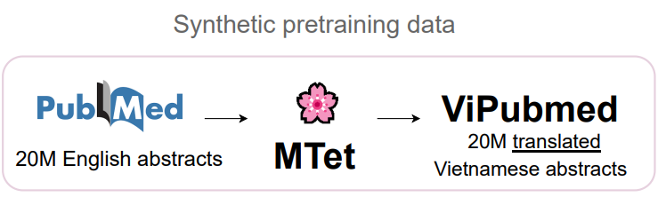
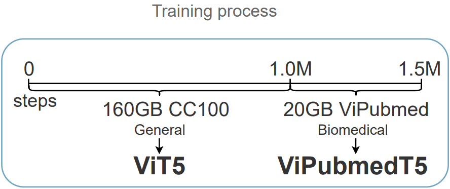

## Introduction
Biomedical data and benchmarks are highly
valuable yet very limited in low-resource languages other than English, such as Vietnamese. In this work, we use a state-of-the-art translation model in English-Vietnamese
to translate and produce both pretrained and
supervised data in the biomedical domains.
Thanks to such large-scale translation, we introduce ViPubmedT5, a pretrained EncoderDecoder Transformer model trained on 20 million translated abstracts from the high-quality
public PubMed corpus. ViPubMedT5 demonstrates state-of-the-art results on two different
biomedical benchmarks in summarization and
acronym disambiguation. Further, we release
ViMedNLI - a new NLP task in Vietnamese
translated from MedNLI using the recently
public En-vi translation model and carefully
refined by human experts, with evaluations of
existing methods against ViPubmedT5.

## Pubmed and English Biomedical NLP

The [Pubmed](https://pubmed.ncbi.nlm.nih.gov) provides access to the MEDLINE
database which contains titles, abstracts, and
metadata from medical literature since the 1970s.
The dataset consists of more than 34 million
biomedical abstracts from the literature collected
from sources such as life science publications, medical journals, and published online e-books. This
dataset is maintained and updated yearly to include
more up-to-date biomedical documents.

Pubmed Abstract has been the main dataset for
almost any state-of-the-art biomedical domain specific pretrained models, for example:
- [🤗](https://huggingface.co/dmis-lab/biobert-v1.1) BioBERT
- [🤗](https://huggingface.co/microsoft/BiomedNLP-PubMedBERT-base-uncased-abstract) PubmedBERT
- [🤗](https://huggingface.co/docs/transformers/main/model_doc/biogpt) BioGPT

## ViPubmed
To generate a large-scale synthetic translated Vietnamese biomedical corpus, we first look into improving the existing English-Vietnamese translation system in the biomedical translation domain.
After utilizing existing state-of-the-art English-Vietnamese translation work and self-training technique, we large scale translate the
20M English biomedical abstracts to Vietnamese using 4 TPUv2-8 and 4 TPUv3-8.



## ViPubmedT5
With an unlabeled synthetic translated ViPubmed
Corpus, we pretrain and finetune a Transformer-based language model to verify the effectiveness of our approach
in enriching Vietnamese biomedical domain with translation data.



We initialize the checkpoint and architecture from [ViT5](https://aclanthology.org/2022.naacl-srw.18), a Vietnamese T5 model.
Then, we pretrain the model on the synthetic translated ViPubmed corpus for 500k steps. We train ViPubmedT5 using the spans masking learning objective.
During self-supervised training, spans of biomedical text sequences are randomly masked (with sentinel tokens). The target sequence is formed as the
concatenation of the same sentinel tokens and the real masked spans/tokens.

## Finetunning Results

We finetune and benchmark our pretrained
ViPubmedT5 model on two public Vietnamese biomedical-domain datasets acrDrAid & FAQSum (from [ViHealthBERT work](https://aclanthology.org/2022.lrec-1.35)) and our released [ViMedNLI dataset](https://github.com/vietai/ViPubmed#3-released-datasets).


## Refer to this work

```bib
@misc{vipubmed,
  doi = {10.48550/ARXIV.2210.05598},
  url = {https://arxiv.org/abs/2210.05598},
  author = {Phan, Long and Dang, Tai and Tran, Hieu and Trinh, Trieu H. and Phan, Vy and Chau, Lam D. and Luong, Minh-Thang},
  keywords = {Computation and Language (cs.CL), Artificial Intelligence (cs.AI), FOS: Computer and information sciences, FOS: Computer and information sciences},
  title = {Enriching Biomedical Knowledge for Low-resource Language Through Large-Scale Translation},
  publisher = {arXiv},
  year = {2022},
  copyright = {Creative Commons Attribution 4.0 International}
}
```