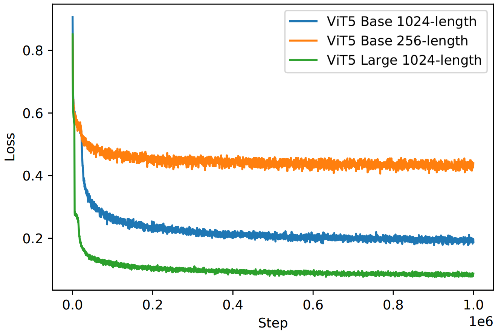
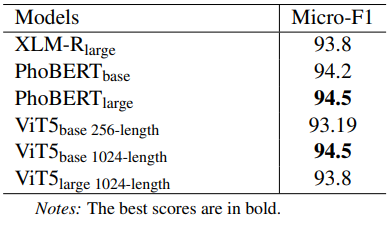

[](https://paperswithcode.com/sota/abstractive-text-summarization-on-vietnews?p=vit5-pretrained-text-to-text-transformer-for)


## Introduction
We present **ViT5**, a pretrained Transformerbased encoder-decoder model for the Vietnamese language. With T5-style selfsupervised pretraining, ViT5 is trained on
a large corpus of high-quality and diverse Vietnamese texts. We benchmark ViT5 on two downstream text generation tasks, **Abstractive Text Summarization** and **Named Entity Recognition (NER)**.
In this work, we validate the performance of ViT5 against many other pretrained Transformer-based encoder-decoder models. 
Our experiments show that ViT5 significantly outperforms existing models and achieves state-of-the-art results on Vietnamese Text Summarization. On the task of Named Entity Recognition, ViT5 is competitive against previous best results from pretrained encoder-based Transformer models.

## ViT5
In this section, we will explain our newly released ViT5 models, the vocabulary generation steps, the pretraining data, and the training setup. 

### Pretraining Data

We use the CC100 Dataset (Monolingual Datasets from Web Crawl Data) [^1]
The total size for the Vietnamese Corpus is 138GB of raw text. We process and filter out 69GB of short paragraphs for 256-length model and 71GB of long paragraphs for 1024-length model.

[^1]: https://huggingface.co/datasets/cc100

### Vocabulary
Different from some other current Vietnamese Transformer-based language models, we find that an effective vocabulary can contribute a significant improvement to our model performance. 
Therefore, we did pre-process on a 5GB subset of our pretraining corpus with care like normalizing punctuation and capitalization, splitting numbers. 
We fixed the size of vocabulary to 36K sub-words and trained SentencePiece[^2] model on that dataset.

[^2]: https://github.com/google/sentencepiece

### Model
ViT5 follows the encoder-decoder architecture and the T5 framework[^3]. 
The original works of T5 proposed five different configs of model size: small, base, large, 3B, and 11B. For the purpose of practical study, we adapt the base (310M parameters) and large (866M parameters) models for ViT5 models and leave bigger models for future works. 

We train ViT5 models with two different input and output lengths: <ins>256-length</ins> and <ins>1024-length</ins>. We thoroughly experimented with these two models to have an insight into the importance of pretraining data length for summarization tasks. For the self-supervised training learning objectives, we use the span-corruption objective with a corruption rate of 15%.

Figure 1 shows the computed loss during the self-supervised training stage for the three models. Larger model with larger context optimizes much better, which leads to better downstream performance.

[^3]: https://github.com/google-research/text-to-text-transfer-transformer


*Figure 1: Loss curves for the masked span prediction task were used to pretrain the ViT5 models.*

## Results
### Abstractive Summarization
We report the results of the ViT5 models on two datasets: Wikilingua[^4] and Vietnews (VNDS)[^5] against other pre-trained transformer models in Table 1.


*Table 1: Test result on Wikilingua and Vietnews Abstractive Summarization. The best scores are in bold and second best scores are underlined. The scores in gray color are our experiments. Code and models for reproducing our experiments: https://github.com/vietai/ViT5*

Our experiments show that both ViT5<sub>base</sub> and ViT5<sub>large</sub> achieves state-of-the-art results on summarization in both Wikilingua and Vietnews corpus. 
With around 270M parameters for both encoder-decoder, ViT5<sub>base</sub> outperforms other existing pre-trained Vietnamese model like BARTpho which is much larger.
ViT5 checkpoints for both pre-training, finetuning, and inference are available at [VietAI's HuggingFace](https://huggingface.co/VietAI).

[^4]: https://github.com/esdurmus/Wikilingua

[^5]: https://github.com/ThanhChinhBK/vietnews

### Named Entity Recognition (NER)

To verify the effectiveness of ViT5 on classification tasks, we test our models on PhoNER_COVID19 dataset [^6]. 
PhoNER is a dataset for recognizing named entities related to the COVID19 domain in Vietnamese. The dataset consists of 35,000 entities in over 10,000 sentences.


*Table 2: Test results on PhoNER_COVID19*

The ViT5<sub>large 1024-length</sub> model, although effective in generating Vietnamese abstractive summarization, shows its limitation in classification tasks with lower F1 scores on NER task. 
On the other hand, our ViT5<sub>base 1024-length</sub> model still performs slightly better than PhoBERT<sub>base</sub> and competitively the same as the current state-of-the-art PhoBERT<sub>large</sub> on the PhoNER corpus.


[^6]: https://github.com/VinAIResearch/PhoNER_COVID19

## 🤗 Hugging Face 
```python
from transformers import AutoTokenizer, AutoModelForSeq2SeqLM
​
tokenizer = AutoTokenizer.from_pretrained("VietAI/vit5-large-vietnews-summarization")  
model = AutoModelForSeq2SeqLM.from_pretrained("VietAI/vit5-large-vietnews-summarization")
​
sentence = "VietAI là tổ chức phi lợi nhuận với sứ mệnh ươm mầm tài năng về trí tuệ nhân tạo và xây dựng một cộng đồng các chuyên gia trong lĩnh vực trí tuệ nhân tạo đẳng cấp quốc tế tại Việt Nam."
text =  "vietnews: " + sentence + " </s>"
encoding = tokenizer.encode_plus(text, pad_to_max_length=True, return_tensors="pt")
input_ids, attention_masks = encoding["input_ids"].to("cuda"), encoding["attention_mask"].to("cuda")
outputs = model.generate(
    input_ids=input_ids, attention_mask=attention_masks,
    max_length=256,
    early_stopping=True
)
for output in outputs:
    line = tokenizer.decode(output, skip_special_tokens=True, clean_up_tokenization_spaces=True)
    print(line)
```

## Acknowledgement

We would like to thank the Google TPU Research Cloud (TRC) program and VietAI for providing us with free access to TPU v3-8 to train and finetune large ViT5 models. 


## Refer to this work

```
@misc{vit5,
  doi = {10.48550/ARXIV.2205.06457},
  author = {Phan, Long and Tran, Hieu and Nguyen, Hieu and Trinh, Trieu H.},
  title = {ViT5: Pretrained Text-to-Text Transformer for Vietnamese Language Generation},
  publisher = {arXiv},
  year = {2022},
}

```

## References

[1] Faisal Ladhak, Esin Durmus, Claire Cardie, and Kathleen R. McKeown. 2020. Wikilingua: A new benchmark dataset for cross-lingual abstractive summarization. CoRR, abs/2010.03093

[2] Dat Quoc Nguyen and Anh Tuan Nguyen. 2020. PhoBERT: Pre-trained language models for Vietnamese. In Findings of the Association for Computational Linguistics: EMNLP 2020, pages 1037–1042.

[3] Hieu Nguyen, Long Phan, James Anibal, Alec Peltekian, and Hieu Tran. 2021. VieSum: How Robust Are Transformer-based Models on Vietnamese Summarization?

[4] Van-Hau Nguyen, Thanh-Chinh Nguyen, Minh-Tien Nguyen, and Nguyen Hoai. 2019. Vnds: A vietnamese dataset for summarization. pages 375–380

[5] Colin Raffel, Noam Shazeer, Adam Roberts, Katherine Lee, Sharan Narang, Michael Matena, Yanqi Zhou, Wei Li, and Peter J. Liu. 2019. Exploring the limits of transfer learning with a unified text-to-text transformer. CoRR, abs/1910.10683.

[6] Nguyen Luong Tran, Duong Minh Le, and Dat Quoc Nguyen. 2021. BARTpho: Pre-trained Sequence-to-Sequence Models for Vietnamese

[7] Ashish Vaswani, Noam Shazeer, Niki Parmar, Jakob Uszkoreit, Llion Jones, Aidan N. Gomez, Lukasz Kaiser, and Illia Polosukhin. 2017. Attention is all you need. CoRR, abs/1706.03762.

[8] Guillaume Wenzek, Marie-Anne Lachaux, Alexis Conneau, Vishrav Chaudhary, Francisco Guzm ́an, Armand Joulin, and Edouard Grave. 2020. CCNet: Extracting high quality monolingual datasets from web crawl data. In Proceedings of the 12th Language Resources and Evaluation Conference, page 4003–4012, Marseille, France. European Language Resources Association.

[9] Linting Xue, Noah Constant, Adam Roberts, Mihir Kale, Rami Al-Rfou, Aditya Siddhant, Aditya Barua, and Colin Raffel. 2020. mt5: A massively multilingual pre-trained text-to-text transformer. CoRR, abs/2010.11934.

